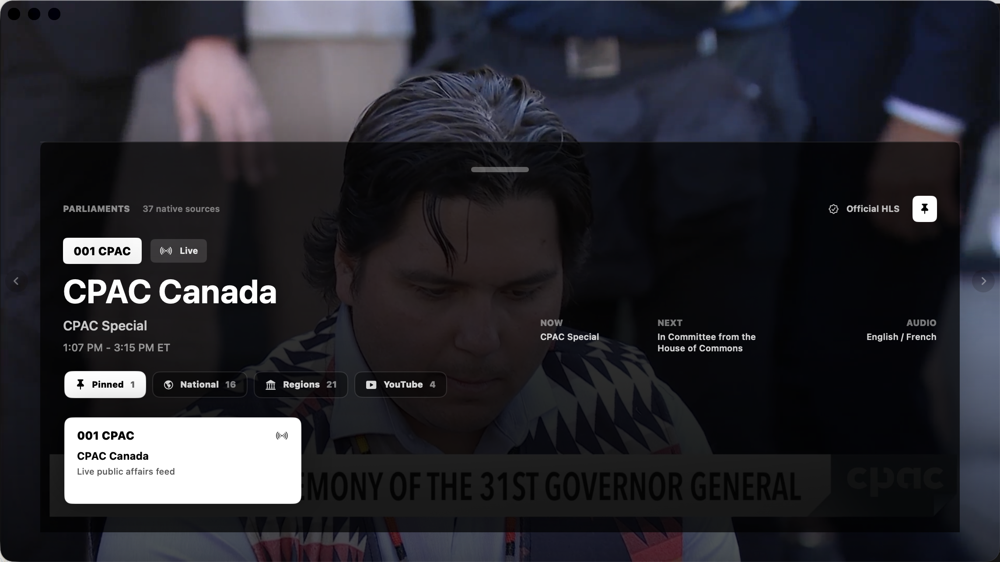
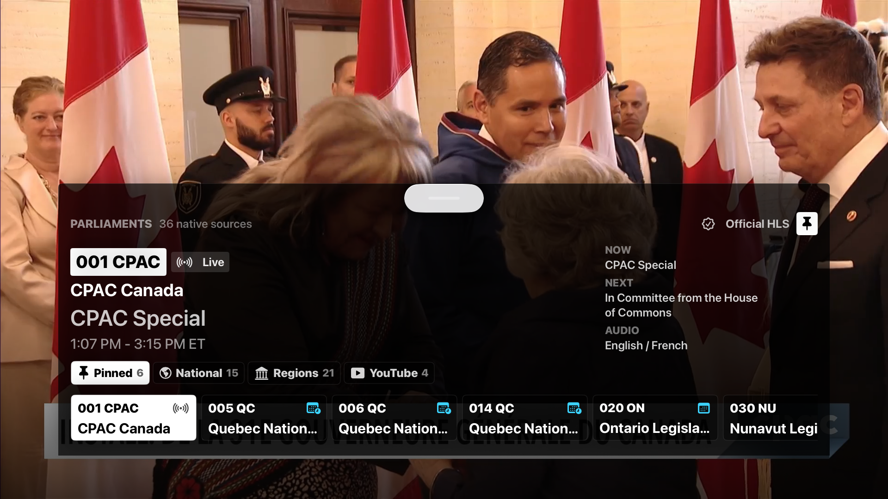
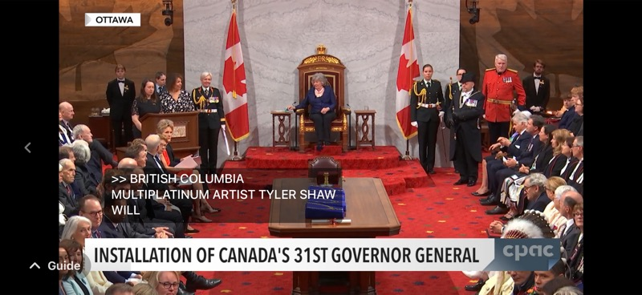
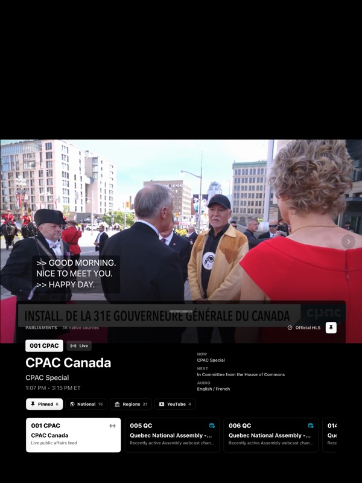

# Parliaments

Parliaments is an experimental SwiftUI app for surfing curated public parliamentary video sources. It is built as a proof of usefulness for open, predictable live streams and schedule metadata from legislatures.

The app currently targets macOS, iOS/iPadOS, and tvOS from one SwiftUI/Xcode project. It favours native AVPlayer-compatible HLS streams when available, and separates sources that require YouTube, a web player, DASH, or an external official page.

## Status

This is a prototype. Source availability, stream URLs, schedules, and terms can change without notice. The catalogue is intentionally curated and conservative; it is not a complete directory of parliamentary video.

This project is not affiliated with, endorsed by, or sponsored by any parliament, legislature, broadcaster, streaming vendor, or video platform.

## Current Capabilities

- Native HLS playback for validated parliamentary streams.
- macOS-only experimental DASH playback path.
- Channel groups for pinned, national, regional, and YouTube/link-out sources.
- Now/next metadata where an official schedule source has been wired.
- Official-source cards for YouTube and other non-native sources.
- Shared SwiftUI interface across macOS, iOS/iPadOS, and tvOS.
- `swift-format` based formatting/linting and Xcode build/test workflow.
- Public GitHub Actions CI for formatting and macOS tests.

## Screenshots

These screenshots show live public video sources as rendered by the app during development. The broadcast content and official marks belong to their respective sources.

| macOS | tvOS |
| --- | --- |
|  |  |

| iPhone | iPad |
| --- | --- |
|  |  |

## Requirements

- macOS with Xcode installed.
- Xcode's bundled `swift-format` available through `xcrun`.
- Simulators matching the destinations in `Makefile` for the full local verification workflow.
- The app currently uses a macOS 15.0 deployment target for CI compatibility; iOS/iPadOS/tvOS targets are still prototype-era Xcode 26 simulator targets.

## Build and Verify

Check formatting:

```sh
make format-check
```

Format Swift sources:

```sh
make format
```

Run macOS tests:

```sh
make test
```

Run the full local verification pass:

```sh
make verify
```

`make verify` runs whitespace checks, `swift-format` lint, macOS tests, iPhone simulator build, iPad simulator build, and tvOS simulator build.

GitHub Actions currently runs a conservative public-repository CI baseline: whitespace checks, `swift-format` lint, and macOS tests. The full simulator build matrix remains a local `make verify` workflow until the CI environment and simulator destinations are stabilized.

## Repository Layout

```text
App/                  SwiftUI app, models, catalogue, playback, schedule adapters
Tests/                Unit tests for catalogue, schedule adapters, and metadata
Scripts/verify.sh     Local verification workflow
plan.md               Product and implementation plan
research.md           Research log for stream and schedule feasibility
docs/                 Public notices and source/provenance notes
```

## Known Limitations

- Source URLs, stream availability, schedules, captions, and terms can drift.
- Legal/source labels are conservative implementation notes, not legal advice.
- Schedule coverage is uneven: some channels have now/next metadata, while others only expose signal state.
- YouTube, DASH, and official web-player sources are second-class compared with native HLS playback.
- The public CI workflow does not yet run the full iPhone, iPad, and tvOS simulator build matrix.
- There are currently no accounts, analytics, iCloud sync, or server-side popularity features.

## Source and Rights Notes

The code is licensed under the BSD 3-Clause license. Stream URLs, official pages, screenshots, preview captures, marks, and broadcast content are not owned by this project and may be subject to separate terms.

See [docs/sources-and-provenance.md](docs/sources-and-provenance.md) before reusing catalogue entries, preview images, or design assets outside this prototype.

See [PRIVACY.md](PRIVACY.md) for the current prototype privacy posture.

See [SECURITY.md](SECURITY.md) for sensitive reporting guidance.

## Research Log

`research.md` is a working research log. It includes successful checks, failed checks, dead ends, candidate sources, and notes that may become stale. Treat it as evidence of exploration, not as an endorsed public stream directory.

## Contributing

Source corrections and playback fixes are welcome when they are backed by official source URLs and validation notes. See [CONTRIBUTING.md](CONTRIBUTING.md).

Use GitHub issue templates for playback bugs, source corrections, schedule metadata issues, and UI/platform problems.

## Why This Exists

Public parliamentary video is often available, but not always in predictable, machine-readable, app-friendly forms. A polished viewer helps demonstrate the practical value of stable HLS feeds, documented embeds, schedule APIs, captions, audio language metadata, and clear terms of use.
